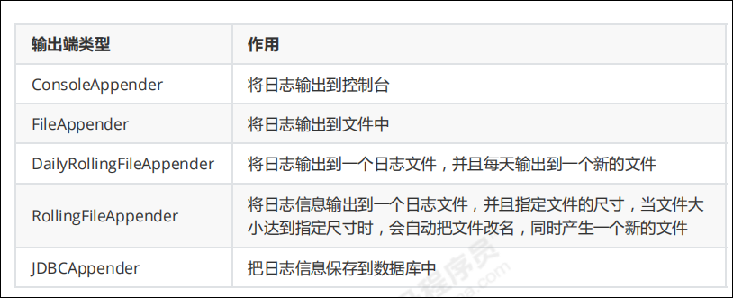

 ## Log4j组件
Log4J 主要由 Loggers (日志记录器)、Appenders（输出端）和 Layout（日志格式化器）组成。
* Loggers 控制日志的输出级别与日志是否输出；
* Appenders 指定日志的输出方式（输出到控制台、文件等）；
* Layout 控制日志信息的输出格式。

###  Loggers
日志记录器，负责收集处理日志记录，实例的命名就是类“XX”的full quailied name（类的全限定名），   
**Logger的名字大小写敏感，其命名有继承机制**：  
例如：name为org.apache.commons的logger会继承name为org.apache的logger。

Log4J中有一个特殊的logger叫做“root”，他是所有logger的根，也就意味着其他所有的logger都会直接
或者间接地继承自root。   
root logger可以用Logger.getRootLogger()方法获取。

### Appenders

Appender 用来指定日志的输出目的地。Log4j 常用的输出目的地
有以下几种：

###日志写入数据库

CREATE TABLE `log` ( 
    `log_id` int(11) NOT NULL AUTO_INCREMENT,    
    `project_name` varchar(255) DEFAULT NULL COMMENT '目项名',    
    `create_date` varchar(255) DEFAULT NULL COMMENT '创建时间',   
    `level` varchar(255) DEFAULT NULL COMMENT '优先级',   
    `category` varchar(255) DEFAULT NULL COMMENT '所在类的全名',   
    `file_name` varchar(255) DEFAULT NULL COMMENT '输出日志消息产生时所在的文件名称 ',    
    `thread_name` varchar(255) DEFAULT NULL COMMENT '日志事件的线程名',    
    `line` varchar(255) DEFAULT NULL COMMENT '号行',   
    `all_category` varchar(255) DEFAULT NULL COMMENT '日志事件的发生位置',   
    `message` varchar(4000) DEFAULT NULL COMMENT '输出代码中指定的消息',    
     PRIMARY KEY (`log_id`)   
 );
